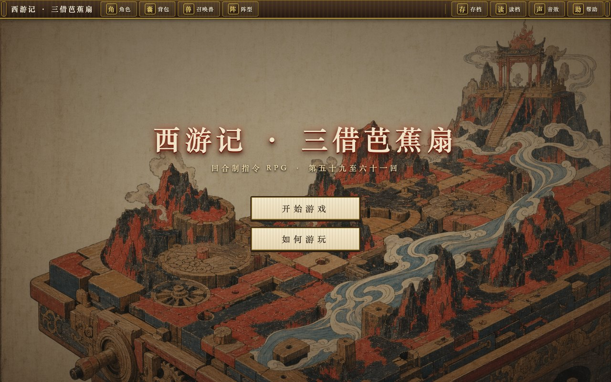

# NovelToGame

> 把任何小说变成可玩的网页游戏。

NovelToGame 是一套把小说改编成网页游戏的开源技能，适配 Claude Code、Codex 和 Kimi Code。
它先从原著里找出真正能玩的部分，挑一个合适的改编方向，设计出可玩的世界和画面，再把一份
范围明确的构建说明交给编码智能体去实现，最后验证成品能不能跑起来。

[English](README_EN.md)

## 为什么需要它

直接把小说丢给模型做游戏，出来的多半是换皮的通用玩法。NovelToGame 解决真正难的那一步：
把这本书特有的世界观、地图、势力、任务、物品和情绪变成玩家动作和核心循环，判断它该做成什么游戏，再一路推进到
能玩的原型。

## 流程

一个总入口先框定产品需求，再串起六个各司其职的环节，把原始文本一路打磨成可验证、可游玩的原型。


「需求」是第一步：拿到小说先和用户明确**平台（客户端/网页/小程序）、游戏类型与对标名作（按小说语言对应的市场找）、美术画风、内容分级/NSFW、核心幻想、游戏引擎**等产品框架，锁进 `PRODUCT_BRIEF.md`，下游各阶段一律遵守、不得静默改写。对标与引擎都要 WebSearch 联网核实，不凭记忆。

## 技能

| 技能 | 职责 |
|---|---|
| `novel-to-game` | 总入口：先过需求 intake 锁定 `PRODUCT_BRIEF`（平台/类型+对标/画风/分级/核心幻想），再以 quick / director 两种模式串起全流程 |
| `novel-game-analyze` | 提取规则、动作、空间、角色、系统与名场面，梳理成一份游戏设定集 |
| `game-concept` | 生成、淘汰并从三个真正不同的方案中做出选择 |
| `game-world-design` | 设计玩家体验、会回应的世界、系统、关卡与完整可玩原型 |
| `game-art-direction` | 定义核心视觉原则、镜头、世界的视觉语言、界面、反馈与招牌画面 |
| `game-build` | 写出构建说明，并让编码智能体完成一次可验证的构建 |
| `game-qa` | 验证启动、画面、交互、状态切换、通关与重开 |

## 通过 Agent Skills 安装

为你使用的 CLI 安装全部七个技能：

| Agent CLI | 安装命令 | 调用方式 |
|---|---|---|
| Claude Code | `npx skills add worldwonderer/novel-to-game -g -y -a claude-code -s '*'` | `/novel-to-game` |
| Codex | `npx skills add worldwonderer/novel-to-game -g -y -a codex -s '*'` | `$novel-to-game` |
| Kimi Code | `npx skills add worldwonderer/novel-to-game -g -y -a kimi-code-cli -s '*'` | `/skill:novel-to-game` |

同时安装三端，重复 `-a` 即可：

```bash
npx skills add worldwonderer/novel-to-game -g -y -s '*' \
  -a claude-code -a codex -a kimi-code-cli
```

克隆仓库后，三端也都能发现项目内的 7 个技能。

## 原生插件安装

Claude Code：

```text
/plugin marketplace add worldwonderer/novel-to-game
/plugin install novel-to-game@novel-to-game-skills
/novel-to-game:novel-to-game quick
```

Codex：

```bash
codex plugin marketplace add worldwonderer/novel-to-game
codex plugin add novel-to-game@novel-to-game-skills
```

Kimi Code 0.27 或更高版本：

```text
/plugins install https://github.com/worldwonderer/novel-to-game
/reload
/skill:novel-to-game quick
```

## 快速开始

```text
用 novel-to-game quick 把这本小说做成一个 15 分钟可完整游玩的网页游戏。
玩家以原创身份进入世界，不要逐段复演原作剧情。
```

`quick` 是默认模式，会自动挑证据最强的方案；想在世界设计之前先从三个方向里做选择，
就用 `director` 模式。

## 产出

每次运行都会创建一个紧凑的改编工作区：

```text
game-adaptations/<project>/
  PRODUCT_BRIEF.md
  analysis/SOURCE_BIBLE.md
  concepts/CONCEPT.md
  design/GAME_DESIGN.md
  design/ART_DIRECTION.md
  build/BUILD_BRIEF.md
  build/app/
  qa/QA_REPORT.md
  _progress.md
```

## 完整示例 —— 《西游记》

从完整公版百回本提炼的《三借芭蕉扇》——一款《梦幻西游》风格的回合制指令 RPG。**在线试玩：[xiyouji.vibecoco.ai](https://xiyouji.vibecoco.ai)**



<details>
<summary>展开示例的产出目录树</summary>

```text
examples/journey-to-the-west/
├── source/西游记.txt + SOURCE.md   # 完整公版百回本原著 + 来源出处
├── PRODUCT_BRIEF.md                # 需求 intake：平台/类型+对标/画风/分级/核心幻想
├── analysis/SOURCE_BIBLE.md        # 游戏化设定集：规则、动作、空间、角色、名场面
├── concepts/CONCEPT.md             # 三个真正不同的概念，含入选方案与取舍
├── design/GAME_DESIGN.md           # 系统：行动顺序、五行、技能、携宠、阵型、变化、多阶段Boss
├── design/ART_DIRECTION.md         # 木刻视觉风格、战斗舞台、界面、招牌画面
├── build/BUILD_BRIEF.md            # 交给编码智能体的、不挑模型、范围明确的构建说明
└── build/app/                      # 已构建的可玩游戏——运行方式见 build/app/RUN.md
```

</details>

## 完整示例 —— 《金瓶梅》

从公版崇祯本提炼的《大宅两本账》——一款回合制宅斗策略：明面的位次榜与暗地的私房账此消彼长，到第七十九回家主暴亡、明账一笔勾销。**成人向（17+），情欲作权力货币，笔法留白、不涉露骨**。**在线试玩：[jinpingmei.vibecoco.ai](https://jinpingmei.vibecoco.ai)**


<details>
<summary>展开示例的产出目录树</summary>

```text
examples/jin-ping-mei/
├── source/金瓶梅.txt + SOURCE.md   # 公版崇祯本百回原著（删节洁本）+ expurgate.py 可复现生成
├── PRODUCT_BRIEF.md                # 需求 intake：网页·中文·宅斗对标熹妃传/恋与·成人向
├── analysis/SOURCE_BIBLE.md        # 游戏化设定集：名分与恩宠、私财、情报网、节令时钟
├── concepts/CONCEPT.md             # 三个真正不同的概念，含入选方案与硬否决
├── design/GAME_DESIGN.md           # 系统：明暗两账、五类行动、风声与发落、五种结局
├── design/ART_DIRECTION.md         # 绣像视觉风格、宅院剖面、功能三色、招牌画面
├── build/BUILD_BRIEF.md            # 交给编码智能体的、不挑模型、范围明确的构建说明
└── build/app/                      # 已构建的可玩游戏——运行方式见 build/app/RUN.md
```

</details>

## 致谢

[linux.do](https://linux.do)
