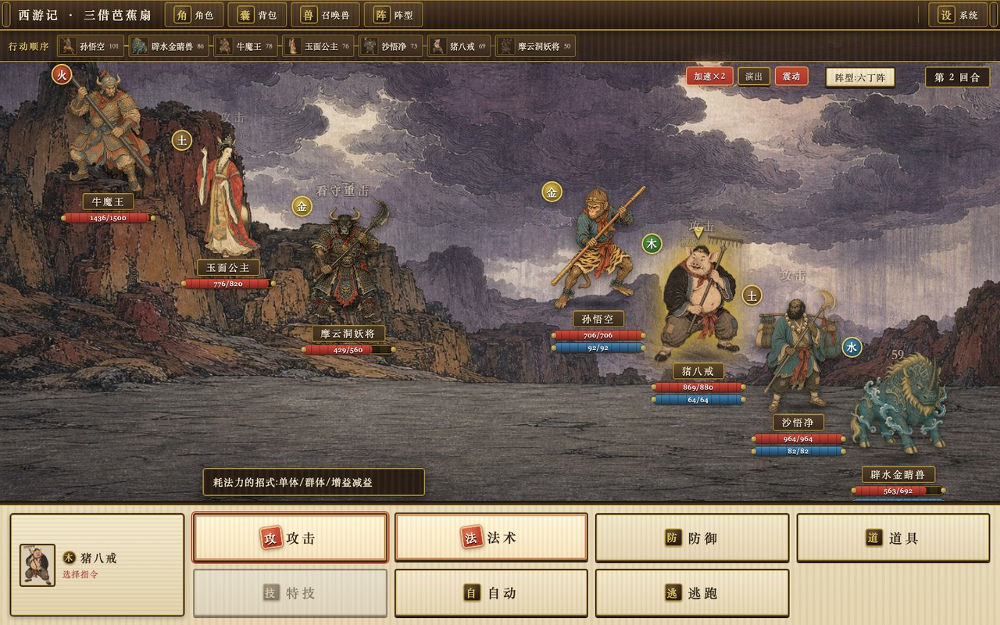
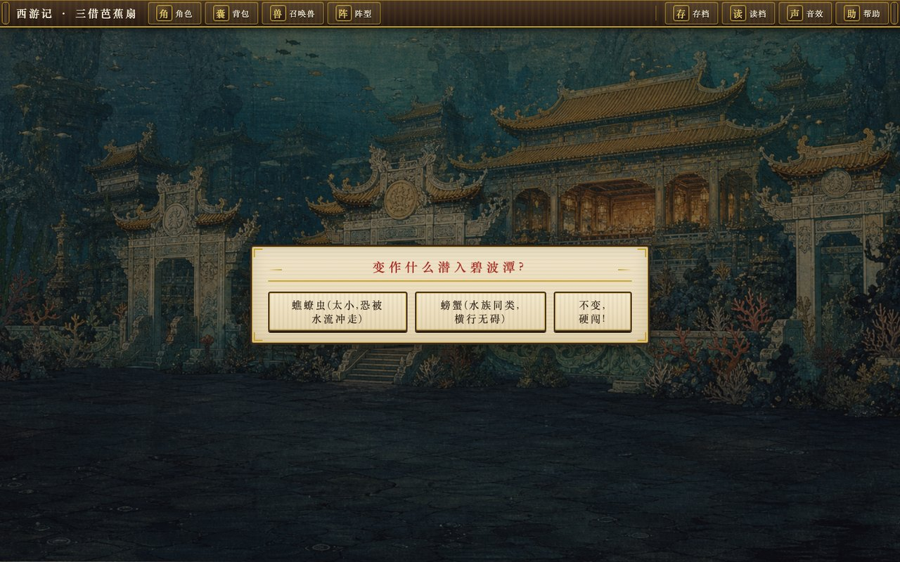
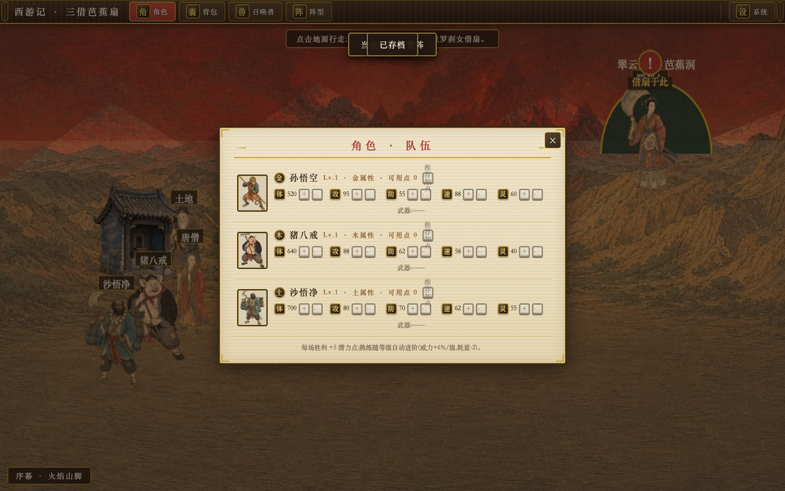
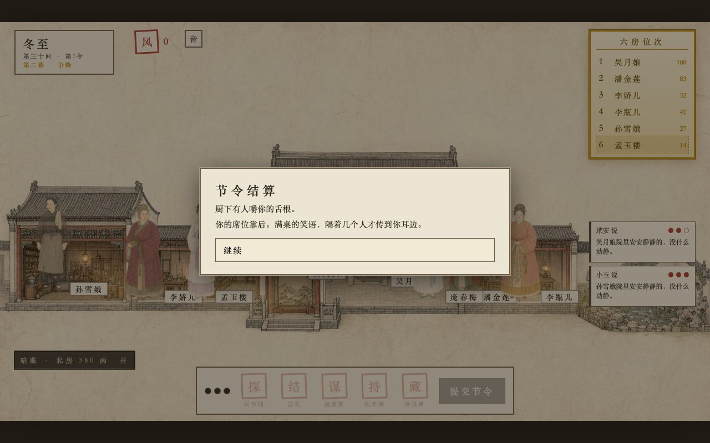
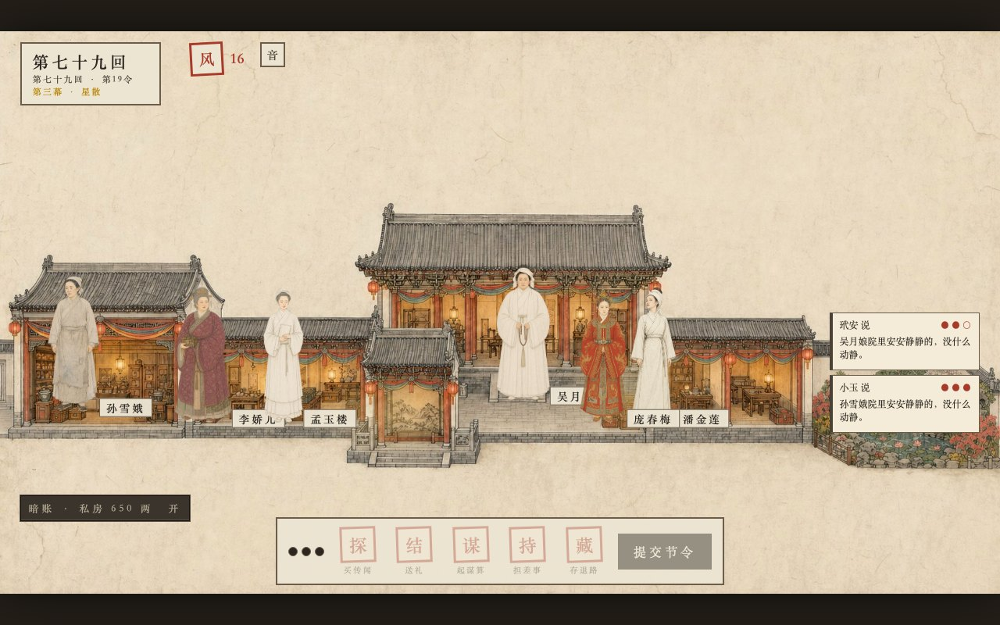

# NovelToGame

> 把任何小说变成可玩的网页游戏。

NovelToGame 是一套把小说改编成网页游戏的开源技能，适配 Claude Code、Codex 和 Kimi Code。
它先从原著里找出真正能玩的部分，挑一个合适的改编方向，设计出可玩的世界和画面，再把一份
范围明确的构建说明交给编码智能体去实现，最后验证成品能不能跑起来。

[English](README_EN.md)

## 为什么需要它

直接把小说丢给模型做游戏，出来的多半是换皮的通用玩法。NovelToGame 解决真正难的那一步：
把这本书特有的世界观、地图、势力、任务、物品和情绪变成玩家动作和核心循环，判断它该做成什么游戏，再一路推进到
能玩的原型。

## 流程

一个总入口串起六个各司其职的环节，把原始文本一路打磨成可验证、可游玩的原型。


## 技能

| 技能 | 职责 |
|---|---|
| `novel-to-game` | quick / director 两种模式的完整流程总入口 |
| `novel-game-analyze` | 提取规则、动作、空间、角色、系统与名场面，梳理成一份游戏设定集 |
| `game-concept` | 生成、淘汰并从三个真正不同的方案中做出选择 |
| `game-world-design` | 设计玩家体验、会回应的世界、系统、关卡与完整可玩原型 |
| `game-art-direction` | 定义核心视觉原则、镜头、世界的视觉语言、界面、反馈与招牌画面 |
| `game-build` | 写出构建说明，并让编码智能体完成一次可验证的构建 |
| `game-qa` | 验证启动、画面、交互、状态切换、通关与重开 |

## 通过 Agent Skills 安装

为你使用的 CLI 安装全部七个技能：

| Agent CLI | 安装命令 | 调用方式 |
|---|---|---|
| Claude Code | `npx skills add worldwonderer/novel-to-game -g -y -a claude-code -s '*'` | `/novel-to-game` |
| Codex | `npx skills add worldwonderer/novel-to-game -g -y -a codex -s '*'` | `$novel-to-game` |
| Kimi Code | `npx skills add worldwonderer/novel-to-game -g -y -a kimi-code-cli -s '*'` | `/skill:novel-to-game` |

同时安装三端，重复 `-a` 即可：

```bash
npx skills add worldwonderer/novel-to-game -g -y -s '*' \
  -a claude-code -a codex -a kimi-code-cli
```

克隆仓库后，三端也都能发现项目内的 7 个技能。

## 原生插件安装

Claude Code：

```text
/plugin marketplace add worldwonderer/novel-to-game
/plugin install novel-to-game@novel-to-game-skills
/novel-to-game:novel-to-game quick
```

Codex：

```bash
codex plugin marketplace add worldwonderer/novel-to-game
codex plugin add novel-to-game@novel-to-game-skills
```

Kimi Code 0.27 或更高版本：

```text
/plugins install https://github.com/worldwonderer/novel-to-game
/reload
/skill:novel-to-game quick
```

## 快速开始

```text
用 novel-to-game quick 把这本小说做成一个 15 分钟可完整游玩的网页游戏。
玩家以原创身份进入世界，不要逐段复演原作剧情。
```

`quick` 是默认模式，会自动挑证据最强的方案；想在世界设计之前先从三个方向里做选择，
就用 `director` 模式。

## 产出

每次运行都会创建一个紧凑的改编工作区：

```text
game-adaptations/<project>/
  analysis/SOURCE_BIBLE.md
  concepts/CONCEPT.md
  design/GAME_DESIGN.md
  design/ART_DIRECTION.md
  build/BUILD_BRIEF.md
  build/app/
  qa/QA_REPORT.md
  _progress.md
```

## 完整示例 —— 《西游记》

[《西游记》](examples/journey-to-the-west/) 示例把整条流程走通：从完整的公版百回本中文
原著，提炼成《三借芭蕉扇》——一款《梦幻西游》《问道》风格的回合制指令 RPG。


| 多人对阵指令战斗 | 碧波潭·变化潜入 |
|---|---|
|  |  |



一段约 45-90 分钟的单人战役，把原著第五十九至六十一回做成九段可玩桥段——从罗刹女一扇吹飞、
灵吉授定风丹，到玉面公主之战、碧波潭变螃蟹偷辟水金睛兽（收为可上阵召唤兽），再到众神围剿、
牛魔王白牛真身、真扇三段息火生风落雨。游戏保留中文玩家一眼就认出的回合制西游玩法——速度
行动顺序、指令菜单、五行相克、携召唤兽出战、阵型、悟空七十二变——外加升级加点、法术熟练、
剧情装备与规则型法宝，全用一套原创的明代木刻套印美术呈现。代码由 Kimi K3 生成、美术由
gpt-image-2 生成，并且自带验证：146 项引擎断言 + 一次 Playwright 全程走查，控制台 0 报错。

<details>
<summary>展开示例的产出目录树</summary>

```text
examples/journey-to-the-west/
├── source/西游记.txt + SOURCE.md   # 完整公版百回本原著 + 来源出处
├── analysis/SOURCE_BIBLE.md        # 游戏化设定集：规则、动作、空间、角色、名场面
├── concepts/CONCEPT.md             # 三个真正不同的概念，含入选方案与取舍
├── design/GAME_DESIGN.md           # 系统：行动顺序、五行、技能、携宠、阵型、变化、多阶段Boss
├── design/ART_DIRECTION.md         # 木刻视觉风格、战斗舞台、界面、招牌画面
├── build/BUILD_BRIEF.md            # 交给编码智能体的、不挑模型、范围明确的构建说明
└── build/app/                      # 已构建的可玩游戏——运行方式见 build/app/RUN.md
```

</details>

## 完整示例 —— 《金瓶梅》

[《金瓶梅》](examples/jin-ping-mei/) 示例用同一条流程做出完全不同的品类：从公版崇祯本
百回原著，提炼成《大宅两本账》——一款回合制家宅经营策略（宅斗）。

**在线试玩：[jinpingmei.vibecoco.ai](https://jinpingmei.vibecoco.ai)**


| 第二幕·争锋（你排第六） | 第七十九回·明账清零 |
|---|---|
|  |  |

你扮演孟玉楼，带着自己的嫁妆嫁进西门家。全屏最显眼的是金色的**六房位次榜**，
它每个节令翻一次牌，一直提醒你往上爬。左下角折叠着一本墨色的**暗账**——私房、人情、
退路，不上榜，不给总分。

五类行动只有「藏」能喂暗账，而「藏」在榜上看起来永远像是在浪费回合。
到第七十九回，西门庆暴亡，位分、体面、宠一笔勾销，排行榜从界面上被抹掉，
结算只清算你偷偷攒下的那一本——并且直接告诉你，你的历史最高位次对结局毫无增益。
原著序言写「蓋為世戒，非為世勸」，这句话由玩法本身讲出来，不靠旁白。

约 60-90 分钟、24 个节令、三幕、五种结局。含不完全情报的仆役传闻网（传闻带可信度且
可能为假）、有进度与知情者的谋算系统、六位各有目标的 AI 对手，以及 21 张原创明代绣像
立绘与宅院剖面图（同一构图三幕三态，家道由盛转衰直接可读）。代码由 Kimi K3 生成、
美术由 gpt-image-2 生成，自带 60 项引擎断言 + 38 项 Playwright 全程走查，控制台 0 报错。

> 内容边界：原著含大量露骨描写，本示例**完全不改编该部分**。仓库内原文为可复现生成的
> 删节洁本（见 [`source/SOURCE.md`](examples/jin-ping-mei/source/SOURCE.md)）；「宠」只作为
> 席位、赏赐、差事、称谓等社会信号出现，不描写也不暗示任何性内容。

<details>
<summary>展开示例的产出目录树</summary>

```text
examples/jin-ping-mei/
├── source/金瓶梅.txt + SOURCE.md   # 公版崇祯本百回原著（删节洁本）+ expurgate.py 可复现生成
├── analysis/SOURCE_BIBLE.md        # 游戏化设定集：名分与恩宠、私财、情报网、节令时钟
├── concepts/CONCEPT.md             # 三个真正不同的概念，含入选方案与硬否决
├── design/GAME_DESIGN.md           # 系统：明暗两账、五类行动、风声与发落、五种结局
├── design/ART_DIRECTION.md         # 绣像视觉风格、宅院剖面、功能三色、招牌画面
├── build/BUILD_BRIEF.md            # 交给编码智能体的、不挑模型、范围明确的构建说明
└── build/app/                      # 已构建的可玩游戏——运行方式见 build/app/RUN.md
```

</details>

## 致谢

[linux.do](https://linux.do)
