# NovelToGame

> Turn any novel into a playable web game.

NovelToGame is an open-source skill set that turns novels into playable web
games, for Claude Code, Codex, and Kimi Code. It reads the source for what is
actually playable, picks a strong adaptation direction, designs the world and
the on-screen experience, then hands a bounded build brief to a coding agent and
checks that the result runs.

[中文](README_ZH.md)

## Why It Exists

Frontier coding models already know how to build web games. The hard part is
deciding what the novel should *become*: who the player is, what they do, how the
world reacts, what the game looks like, and what a complete playable prototype
has to prove. NovelToGame carries that adaptation judgment and leaves the
framework syntax to the model, which already has it.

## Pipeline

One orchestrator drives six specialist stages, from raw text to a verified,
playable prototype.

```mermaid
flowchart LR
    classDef entry fill:#eef2ff,color:#1e1b4b,stroke:#6366f1,stroke-width:1px
    classDef stage fill:#e8f4fd,color:#0f172a,stroke:#4a9be8,stroke-width:1px
    classDef ship fill:#fce4ec,color:#333,stroke:#e57373,stroke-width:1px

    novel{{"novel / oh-story project"}}:::entry
    orch(["novel-to-game<br/>orchestrator"]):::entry

    a["novel-game-analyze<br/>source bible"]:::stage
    c["game-concept<br/>3 concepts, 1 chosen"]:::stage
    w["game-world-design<br/>systems and levels"]:::stage
    art["game-art-direction<br/>visual identity"]:::stage
    b["game-build<br/>build brief → prototype"]:::stage
    qa["game-qa<br/>evidence-based QA"]:::ship

    game(["playable web game"]):::ship

    novel --> orch
    orch --> a --> c --> w --> art --> b --> qa --> game
    qa -.->|fails| b
```



## Skills

| Skill | Purpose |
|---|---|
| `novel-to-game` | Orchestrate the complete pipeline in quick or director mode |
| `novel-game-analyze` | Extract canon, verbs, systems, spaces, agents, and signature moments into a source bible |
| `game-concept` | Propose, reject, and choose between three genuinely different games |
| `game-world-design` | Define player experience, world behavior, systems, levels, and the playable prototype |
| `game-art-direction` | Define visual pillars, camera, world grammar, HUD, feedback, and signature frames |
| `game-build` | Produce the build brief and drive an implementation agent to a verified build |
| `game-qa` | Verify startup, rendering, interaction, state transitions, completion, and restart |

## Install With Agent Skills

Install all seven skills for the CLI you use:

| Agent CLI | Install command | Invoke |
|---|---|---|
| Claude Code | `npx skills add worldwonderer/novel-to-game -g -y -a claude-code -s '*'` | `/novel-to-game` |
| Codex | `npx skills add worldwonderer/novel-to-game -g -y -a codex -s '*'` | `$novel-to-game` |
| Kimi Code | `npx skills add worldwonderer/novel-to-game -g -y -a kimi-code-cli -s '*'` | `/skill:novel-to-game` |

To install all three adapters at once, repeat `-a`:

```bash
npx skills add worldwonderer/novel-to-game -g -y -s '*' \
  -a claude-code -a codex -a kimi-code-cli
```

Cloning the repository also enables project-local discovery in all three CLIs.

## Native Plugin Install

Claude Code:

```text
/plugin marketplace add worldwonderer/novel-to-game
/plugin install novel-to-game@novel-to-game-skills
/novel-to-game:novel-to-game quick
```

Codex:

```bash
codex plugin marketplace add worldwonderer/novel-to-game
codex plugin add novel-to-game@novel-to-game-skills
```

Kimi Code 0.27 or newer:

```text
/plugins install https://github.com/worldwonderer/novel-to-game
/reload
/skill:novel-to-game quick
```

This targets the current [MoonshotAI/kimi-code](https://github.com/MoonshotAI/kimi-code)
CLI, not the retired Python `kimi-cli` package.

## Quick Start

```text
Turn this novel into a complete 15-minute web game with novel-to-game quick.
The player should enter the world as an original character rather than replay
the protagonist's exact plot.
```

`quick` is the default and auto-selects the best-evidenced concept. Use
`director` when you want to pick between three concept directions before world
design begins.

## Output

Each run creates a compact adaptation workspace:

```text
game-adaptations/<project>/
  analysis/SOURCE_BIBLE.md
  concepts/CONCEPT.md
  design/GAME_DESIGN.md
  design/ART_DIRECTION.md
  build/BUILD_BRIEF.md
  build/app/
  qa/QA_REPORT.md
  _progress.md
```

The build is model-neutral: any capable model can implement the approved brief,
and the game it produces stays the same.

## Worked Example — Journey to the West

[Journey to the West](examples/journey-to-the-west/) shows the complete
novel-to-game planning handoff: from the full 100-chapter public-domain Chinese
text to **Three Borrowings of the Banana Fan**, a deterministic turn-based
stealth-tactics prototype. It carries genre positioning, gameplay benchmarks,
game and art direction, and a provider-neutral build brief.

<details>
<summary>Show the example's output tree</summary>

```text
examples/journey-to-the-west/
├── source/
│   ├── 西游记.txt          # Full 100-chapter public-domain source novel
│   └── SOURCE.md           # Provenance + how the source was imported
├── analysis/
│   └── SOURCE_BIBLE.md     # Gameable canon: rules, verbs, spaces, agents, signature moments
├── concepts/
│   └── CONCEPT.md          # Three materially different concepts, with the chosen one and trade-offs
├── design/
│   ├── GAME_DESIGN.md      # Player fantasy, core loop, systems, levels, fail/restart, prototype scope
│   └── ART_DIRECTION.md    # Visual pillars, camera, world grammar, HUD, signature frames
├── build/
│   └── BUILD_BRIEF.md      # Provider-neutral, bounded brief handed to a coding agent
└── _progress.md            # Pipeline run log tracking each stage's state
```

This example is a planning handoff, so it stops at the build brief. A full run
continues into `build/app/` (the implemented prototype) and `qa/QA_REPORT.md`
(the evidence-based verification), as shown under [Output](#output).

</details>

## Current Scope

The first release targets complete, short web game prototypes. It checks that a
game runs, responds, reaches a designed outcome, and restarts. Long-term fun,
economy balance, and commercial readiness are out of scope for now. Imported
fiction must be content you are allowed to adapt, especially before publishing
generated assets or builds.

## License

MIT
